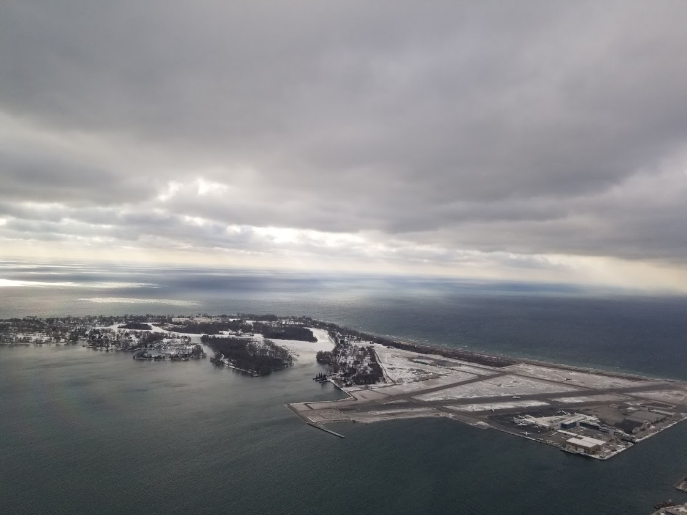

### 2020-3月份旅行总结

好久没写文章，最近因为疫情在家时间比较多，摆弄摆弄vue，几天内就搭建了这么个平台。平台有了，但是总得有内容吧，思来想去写点什么好呢，想起这半年越来越爱总结和归类，我把所有的旅行照片，文档文件都分类整理，备份好存在几个不同的安全的地方，又把想去的地方弄个列表。不如就先写写今年3個月的旅行总结，和今年剩下的时间想去的地方好了。

* _一月份：Yale University, Hartford, Mystic_
* _二月份：多伦多_
* _三月份：Longwood Garden, Lehigh University, Harrisburg_

1月份刚换工作入职没多久，没打算去太远的地方，长周末顶着大雪去了康州转转。之前经过了几次Yale，但是从没在高速上下去，这次终于有机会。Yale校园是我最喜欢的那种哥特风格校園建筑，特别是里面的两个图书馆，包括正常的图书馆和珍惜手稿图书馆，都给我留下了很深刻的印象。下午逛了学校里的美术馆后，找了个街角的咖啡店看小说。第二天去了Hartford, 这是康州的州府，跟滨州的Harrisburg 无论是规模和城市样貌，感觉都差不多。而且我一直觉得美国的城市，除了一些南方类似于萨瓦纳新奥尔良查尔斯顿，或者纽约这种有地方特色的地方，其他真是很多地方大体都差不多。当天还去了Hartford的美术馆，里面的作品感觉很棒，收藏了很多欧洲的18世紀艺术畫作，还有美国本土的现代創作。再之后去了new England附近的小镇Mystic逛逛，附件有个作坊式的博物馆。

其实最近这几个月我也是蛮爱去博物馆的，主要得益于去了新公司之后得知我们可以无障碍免费去纽约基本上任何一个博物馆。我利用几个周末时间把这些纽约博物馆基本都逛了一边，大都會還去了好幾次。

二月份又利用长周末去了一次多伦多，主要是想在签证还有效的时候出国转转，降落的地方非常神奇，就在市中心，其实我是在出发前前几天检查行程才发现通勤的机场不是Toronto Pearson International Airport。而是市中心湖心岛那个小机场。那个小机场其实很棒，起飞和降落的时候都能看见downtown在眼前划过。机场基本只有porter airline的航空，整个候机室只有四个门，所有人都在里面等待，装潢的像vip房间，座椅也非常舒适。在多伦多的几天主要是去Markham吃吃吃，多伦多的中餐比纽约更讲究和精致一些，口感也很好。中间有一天去了尼亚加拉瀑布，之前很多次在美国这边看瀑布，这是第一次在加拿大这边看，感觉很棒。后来囘纽约的时候，我还有点担心回不去，入關的時候特別焦慮怕被找麻煩，當時疫情已经开始蔓延，美国刚出台必须要在非疫情囯待14天等等的规则。

三月份没敢去太远的地方，虽然机票已经很便宜了。就去了滨州几个之前没去的地方，longwood garden。还有州府Harrisburg等地。longwood garden的花房非常漂亮，完全要比匹兹堡或者其他什么地方的在北美我去过的都要好一些。花卉种类的布置都非常好。里海大學離我其實并不遠，開車不到2小説就到，里海大學本身的建築也很好看，建在山坡上，大學所在的小鎮伯利恆非常有特點，很多年前是煉鋼重鎮，現在還可以看見非常震撼的遺留下來的煉鋼設施。

4-5月 打算周末去西弗吉尼亚，弗吉尼亚，还有辛辛那提什么地方逛一圈。今年的欧洲行大概率是泡汤了。如果实在没法去欧洲的话，打赏去阿拉斯加，新墨西哥，波多黎各什么的看看好了。
